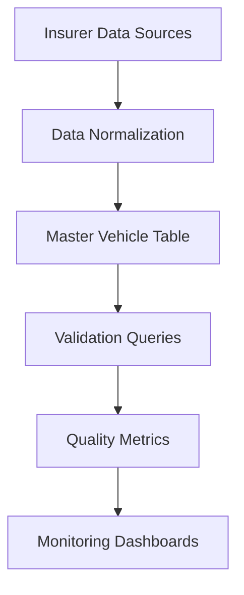
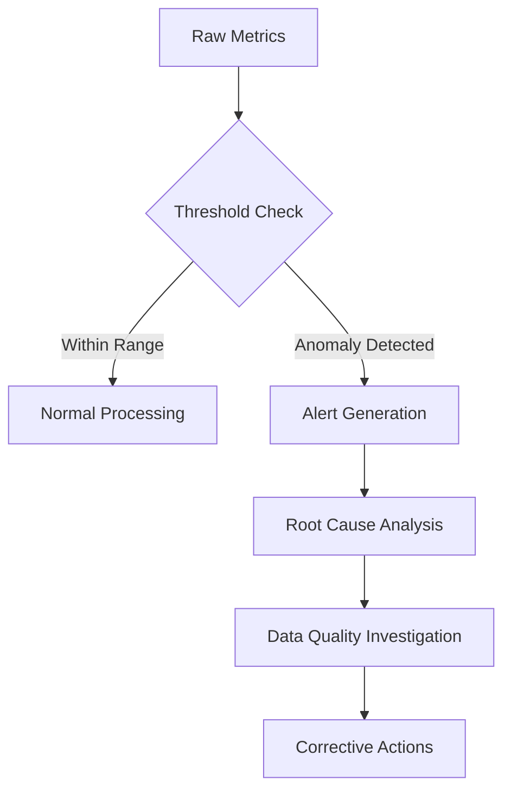
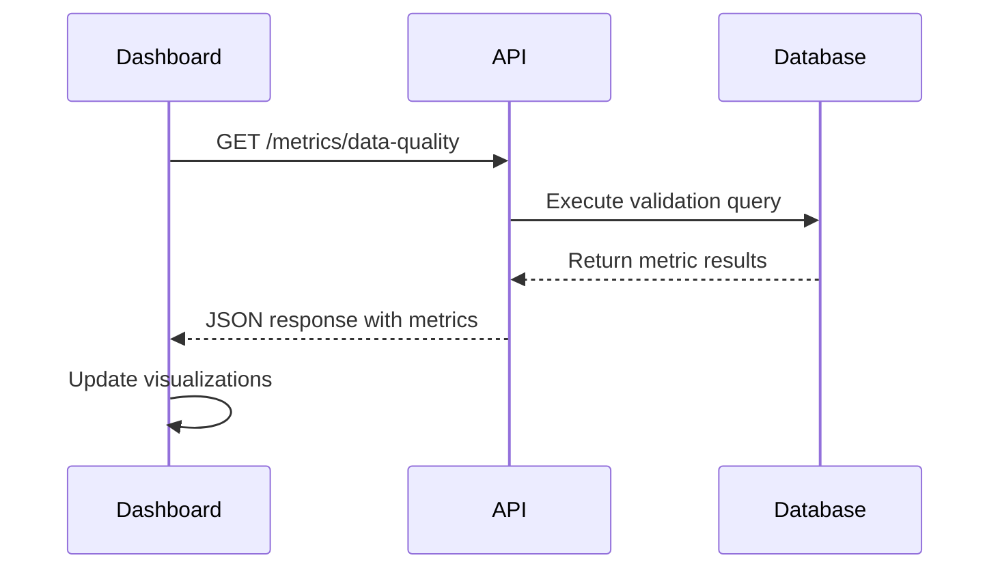
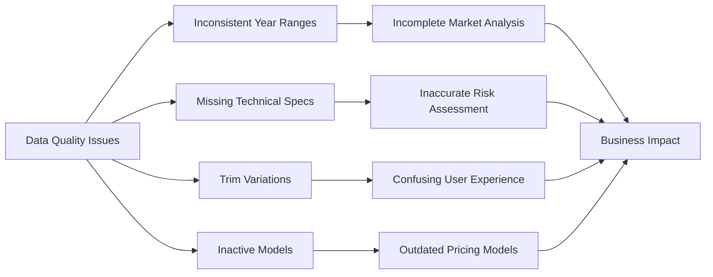

# Data Quality Metrics

<cite>
**Referenced Files in This Document**   
- [Validacion y metricas.sql](file://src/supabase/Validacion y metricas.sql)
- [Tabla maestra.sql](file://src/supabase/Tabla maestra.sql)
- [Funcion RPC Nueva.sql](file://src/supabase/Funcion RPC Nueva.sql)
- [casos de prueba función rpc.sql](file://src/supabase/casos de prueba función rpc.sql)
</cite>

## Table of Contents
1. [Introduction](#introduction)
2. [Data Quality Validation Framework](#data-quality-validation-framework)
3. [Core Data Quality Metrics](#core-data-quality-metrics)
4. [Metric Interpretation and Anomaly Detection](#metric-interpretation-and-anomaly-detection)
5. [Extending Validation Rules](#extending-validation-rules)
6. [Dashboard Integration](#dashboard-integration)
7. [Common Data Quality Issues](#common-data-quality-issues)
8. [Conclusion](#conclusion)

## Introduction
The data quality validation framework ensures the integrity, consistency, and completeness of homologated vehicle data across multiple insurers. This document details how SQL queries in Validacion y metricas.sql assess data quality by calculating key metrics that monitor processing health and identify anomalies. The framework leverages a master vehicle table structure that consolidates data from various insurers, enabling cross-insurer analysis and homologation tracking.

## Data Quality Validation Framework
The validation framework centers around the `vehiculos_maestro` table, which serves as the canonical source of homologated vehicle data. This table stores normalized vehicle information with metadata about insurer availability and homologation confidence. The framework uses SQL queries to extract meaningful metrics about data completeness, consistency, and accuracy.

The master table structure includes critical fields for data quality assessment:
- `id_canonico`: Unique canonical identifier for each vehicle
- `aseguradoras_activas`: Array of active insurers for the vehicle
- `disponibilidad_aseguradoras`: JSONB field storing detailed insurer-specific data
- `hash_comercial`: Hash for commercial attribute grouping
- Indexes on key fields for efficient querying



**Diagram sources**
- [Tabla maestra.sql](file://src/supabase/Tabla maestra.sql#L0-L100)
- [Validacion y metricas.sql](file://src/supabase/Validacion y metricas.sql#L0-L18)

**Section sources**
- [Tabla maestra.sql](file://src/supabase/Tabla maestra.sql#L0-L100)
- [Validacion y metricas.sql](file://src/supabase/Validacion y metricas.sql#L0-L18)

## Core Data Quality Metrics
The validation query in Validacion y metricas.sql calculates several key metrics that assess the completeness and consistency of homologated vehicle data:

```sql
-- Query for homologation level validation
WITH metricas AS (
    SELECT 
        COUNT(*) as total_vehiculos_canonicos,
        COUNT(*) FILTER (WHERE array_length(aseguradoras_activas, 1) >= 2) as con_2_o_mas_aseguradoras,
        COUNT(*) FILTER (WHERE array_length(aseguradoras_activas, 1) >= 3) as con_3_o_mas_aseguradoras,
        AVG(array_length(aseguradoras_activas, 1)) as promedio_aseguradoras,
        MAX(array_length(aseguradoras_activas, 1)) as max_aseguradoras
    FROM vehiculos_maestro
)
SELECT 
    total_vehiculos_canonicos,
    con_2_o_mas_aseguradoras,
    ROUND(100.0 * con_2_o_mas_aseguradoras / total_vehiculos_canonicos, 2) as porcentaje_homologacion_2,
    con_3_o_mas_aseguradoras,
    ROUND(100.0 * con_3_o_mas_aseguradoras / total_vehiculos_canonicos, 2) as porcentaje_homologacion_3,
    ROUND(promedio_aseguradoras::numeric, 2) as promedio_aseguradoras,
    max_aseguradoras
FROM metricas;
```

**Section sources**
- [Validacion y metricas.sql](file://src/supabase/Validacion y metricas.sql#L0-L18)

### Key Metrics Explained
- **Total Canonical Vehicles**: Total count of unique vehicle models in the master table
- **Vehicles with 2+ Insurers**: Count of vehicles available across at least two insurers
- **Homologation Percentage (2+)**: Percentage of vehicles homologated across two or more insurers
- **Vehicles with 3+ Insurers**: Count of vehicles available across at least three insurers
- **Homologation Percentage (3+)**: Percentage of vehicles homologated across three or more insurers
- **Average Insurers per Vehicle**: Mean number of insurers offering each vehicle model
- **Maximum Insurers**: Highest number of insurers offering a single vehicle model

These metrics provide a comprehensive view of data completeness and cross-insurer consistency. High homologation percentages indicate successful data integration across multiple sources, while low percentages may signal data quality issues or limited insurer participation.

## Metric Interpretation and Anomaly Detection
The calculated metrics serve as key performance indicators for monitoring data processing health and identifying anomalies across insurers.

### Example Metric Outputs and Interpretation
Consider a scenario where the query returns:
- Total canonical vehicles: 15,000
- Vehicles with 2+ insurers: 12,750 (85% homologation)
- Vehicles with 3+ insurers: 9,000 (60% homologation)
- Average insurers per vehicle: 2.8
- Maximum insurers: 7

This indicates strong data completeness with 85% of vehicle models available across multiple insurers. The average of 2.8 insurers per vehicle suggests good market coverage.

### Anomaly Detection Scenarios
**Sudden Drop in Active Models**
A significant decrease in the total canonical vehicles metric could indicate:
- Data ingestion failures from one or more insurers
- Systematic filtering of vehicle models due to validation rules
- Changes in insurer data provision

**Unexpected Trim Variations**
When analyzing individual vehicle entries, unexpected trim variations can be detected by examining the `version_original` field in the `disponibilidad_aseguradoras` JSONB structure. For example, if most insurers list a "PREMIUM" trim but one insurer lists a "CORE" trim for the same model year, this discrepancy can be flagged for review.

**Insurer-Specific Anomalies**
By extending the validation query to analyze insurer-specific patterns, anomalies such as:
- Sudden changes in an insurer's active vehicle count
- Inconsistent year ranges for specific models
- Missing technical specifications compared to other insurers



**Diagram sources**
- [Validacion y metricas.sql](file://src/supabase/Validacion y metricas.sql#L0-L18)
- [casos de prueba función rpc.sql](file://src/supabase/casos de prueba función rpc.sql#L0-L255)

**Section sources**
- [Validacion y metricas.sql](file://src/supabase/Validacion y metricas.sql#L0-L18)
- [casos de prueba función rpc.sql](file://src/supabase/casos de prueba función rpc.sql#L0-L255)

## Extending Validation Rules
The validation framework can be extended to address new data quality concerns by modifying or adding SQL queries that target specific data quality dimensions.

### Adding New Validation Rules
To extend the framework for additional data quality checks:

1. **Identify the data quality dimension** (completeness, consistency, accuracy, timeliness)
2. **Determine the validation logic** in SQL
3. **Implement the rule** as an additional query or modify existing queries
4. **Integrate with monitoring systems**

Example extension for missing technical specifications:
```sql
-- Extended validation for missing technical specs
SELECT 
    marca,
    modelo,
    anio,
    COUNT(*) as count_missing_specs,
    ROUND(100.0 * COUNT(*) / total_vehicles, 2) as percentage
FROM vehiculos_maestro,
     LATERAL (SELECT COUNT(*) as total_vehicles FROM vehiculos_maestro) t
WHERE motor_config IS NULL 
    OR carroceria IS NULL 
    OR traccion IS NULL
GROUP BY marca, modelo, anio, total_vehicles
HAVING COUNT(*) > 1
ORDER BY percentage DESC;
```

### Validation Rule Categories
- **Completeness Checks**: Ensure required fields are populated
- **Consistency Checks**: Verify data uniformity across insurers
- **Accuracy Checks**: Validate against known reference data
- **Timeliness Checks**: Monitor data freshness and update frequency

**Section sources**
- [Validacion y metricas.sql](file://src/supabase/Validacion y metricas.sql#L0-L18)
- [Funcion RPC Nueva.sql](file://src/supabase/Funcion RPC Nueva.sql#L0-L428)

## Dashboard Integration
The metric results can be integrated into monitoring dashboards to provide real-time visibility into data quality.

### Dashboard Components
- **Homologation Rate Trend**: Line chart showing homologation percentage over time
- **Insurer Coverage Matrix**: Heatmap showing vehicle availability by insurer
- **Anomaly Alert Panel**: Real-time notifications for detected data quality issues
- **Completeness Scorecard**: Summary of key data quality metrics

### Integration Methods
1. **Direct Database Connection**: Connect dashboard tool directly to the database
2. **API Layer**: Create a REST API endpoint that executes validation queries
3. **Scheduled Export**: Run validation queries on a schedule and export results

Example API integration pattern:


**Diagram sources**
- [Validacion y metricas.sql](file://src/supabase/Validacion y metricas.sql#L0-L18)

**Section sources**
- [Validacion y metricas.sql](file://src/supabase/Validacion y metricas.sql#L0-L18)

## Common Data Quality Issues
Several common issues impact the quality of homologated vehicle data and downstream usage.

### Inconsistent Year Ranges
Different insurers may provide data for different model year ranges, creating gaps in the master dataset. This affects:
- Market analysis completeness
- Pricing model accuracy
- Trend identification

Mitigation strategies include:
- Establishing minimum year range requirements
- Implementing data enrichment from external sources
- Flagging incomplete model years for manual review

### Missing Technical Specifications
Critical technical specifications like engine configuration, body type, or drivetrain may be missing from some insurer data, leading to:
- Inaccurate vehicle classification
- Incorrect risk assessment
- Poor user experience in multiquoting systems

The framework addresses this through progressive enrichment, where missing specifications from one insurer can be filled by data from another insurer for the same vehicle model.

### Data Impact on Downstream Usage
Poor data quality directly impacts downstream applications:
- **Multiquoting Systems**: Incomplete or inconsistent data leads to inaccurate quotes
- **Market Analysis**: Data gaps skew market share calculations and trend analysis
- **Risk Modeling**: Missing technical specifications reduce model accuracy
- **Customer Experience**: Inconsistent vehicle descriptions confuse users



**Diagram sources**
- [Tabla maestra.sql](file://src/supabase/Tabla maestra.sql#L0-L100)
- [casos de prueba función rpc.sql](file://src/supabase/casos de prueba función rpc.sql#L0-L255)

**Section sources**
- [Tabla maestra.sql](file://src/supabase/Tabla maestra.sql#L0-L100)
- [casos de prueba función rpc.sql](file://src/supabase/casos de prueba función rpc.sql#L0-L255)

## Conclusion
The data quality validation framework provides comprehensive monitoring of homologated vehicle data across insurers. By calculating key metrics such as homologation rates, insurer coverage, and data completeness, the framework enables proactive identification of data quality issues. The SQL-based approach in Validacion y metricas.sql offers a transparent and extensible method for assessing data health. Integration with monitoring dashboards allows for real-time visibility into data quality, while the ability to extend validation rules ensures the framework can adapt to new data quality concerns. Addressing common issues like inconsistent year ranges and missing technical specifications is critical for ensuring the reliability of downstream applications that depend on this data.