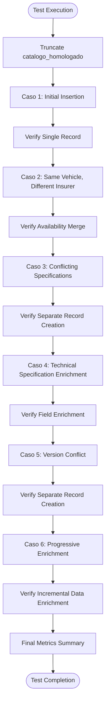
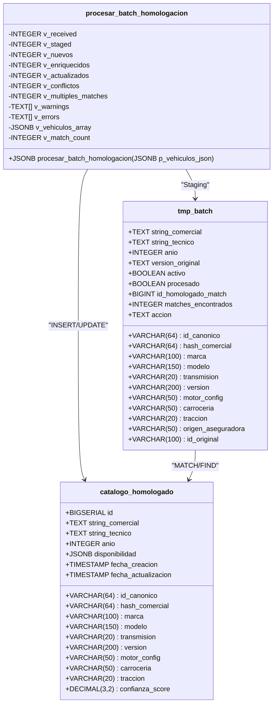
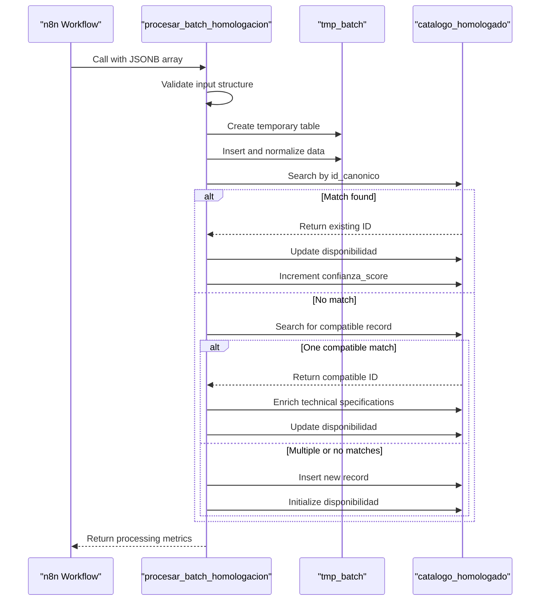

# Test Case Design

<cite>
**Referenced Files in This Document**   
- [casos de prueba función rpc.sql](file://src/supabase/casos de prueba función rpc.sql)
- [Funcion RPC Nueva.sql](file://src/supabase/Funcion RPC Nueva.sql)
- [Tabla maestra.sql](file://src/supabase/Tabla maestra.sql)
- [instrucciones.md](file://instrucciones.md)
- [qualitas-codigo-de-normalizacion-n8n.js](file://src/insurers/qualitas/qualitas-codigo-de-normalizacion-n8n.js)
</cite>

## Table of Contents
1. [Introduction](#introduction)
2. [Test Case Structure and Methodology](#test-case-structure-and-methodology)
3. [Core Test Scenarios Analysis](#core-test-scenarios-analysis)
4. [Idempotency and Data Integrity Validation](#idempotency-and-data-integrity-validation)
5. [JSONB Availability Merging Logic](#jsonb-availability-merging-logic)
6. [Guidelines for New Test Case Creation](#guidelines-for-new-test-case-creation)
7. [Testing Challenges and Best Practices](#testing-challenges-and-best-practices)
8. [Conclusion](#conclusion)

## Introduction

The vehicle catalog homologation system unifies vehicle data from multiple Mexican insurance providers into a canonical model through the `procesar_batch_homologacion` RPC function. This document analyzes the test cases defined in `casos de prueba función rpc.sql` to demonstrate how they validate the system's behavior under various conditions. The tests ensure proper handling of data insertion, updates, conflict resolution, and JSONB availability merging while maintaining data integrity and idempotency. The test suite systematically verifies the homologation logic that enables cross-insurer vehicle catalog consolidation with complete traceability.

**Section sources**
- [instrucciones.md](file://instrucciones.md#L1-L50)

## Test Case Structure and Methodology

The test cases follow a structured methodology using PostgreSQL transactions to ensure isolation and repeatability. Each test case is designed to validate specific aspects of the homologation process, including insertion of new records, updates to existing entries, conflict resolution during upserts, and proper handling of JSONB availability merging. The test suite begins with a transaction block that truncates the `catalogo_homologado` table to ensure a clean state before execution.

The test cases are organized sequentially to build upon previous states, simulating real-world scenarios where multiple insurers contribute data to the same vehicle catalog. Each test case uses the `procesar_batch_homologacion` function with carefully crafted JSONB input that represents vehicle data from different insurers. The test methodology includes verification queries after each operation to validate the expected outcomes, ensuring that the system behaves correctly under various conditions.

**Diagram sources**
- [casos de prueba función rpc.sql](file://src/supabase/casos de prueba función rpc.sql#L1-L20)

**Section sources**
- [casos de prueba función rpc.sql](file://src/supabase/casos de prueba función rpc.sql#L1-L50)

## Core Test Scenarios Analysis

The test suite comprehensively validates the homologation system through six core scenarios that cover critical functionality. Each scenario is designed to test specific aspects of the `procesar_batch_homologacion` function, ensuring robust handling of various data conditions.

### Case 1: Initial Record Insertion
This test validates the basic insertion functionality by processing a Toyota Yaris SEDAN record from Qualitas. The test verifies that a new record is created in the `catalogo_homologado` table with all specified attributes, including the `id_canonico` hash, technical specifications, and availability information for the originating insurer. The verification confirms that the record contains the expected values for marca, modelo, anio, version, carroceria, and that the disponibilidad JSONB field correctly reflects Qualitas as the sole provider.

### Case 2: Availability Merging for Existing Vehicle
This scenario tests the system's ability to merge availability information when the same vehicle (identified by `id_canonico`) is reported by a different insurer (Zurich). The test verifies that no duplicate record is created and instead the existing record is updated to include Zurich in the disponibilidad JSONB field. The verification query confirms that only one record exists for this vehicle with two insurers listed in the availability data, demonstrating proper upsert behavior.

### Case 3: Conflict Resolution with Different Specifications
This test validates conflict resolution when a vehicle with the same commercial hash but different technical specifications (HATCHBACK vs SEDAN) is processed. The system correctly identifies this as a conflict rather than an enrichment opportunity, resulting in the creation of a separate record. The verification confirms two distinct records exist, differentiated by carroceria, each with their respective insurer availability.

### Case 4: Technical Specification Enrichment
This scenario tests the system's ability to enrich existing records with additional technical specifications. When HDI provides motor_config (L4) data for the SEDAN vehicle, the system updates the existing record with this information while preserving other attributes. The verification confirms the enriched record contains the motor_config value and that both Qualitas and Zurich are listed in the availability data.

### Case 5: Version Conflict Handling
This test validates proper handling of version conflicts. When HDI reports a CORE version (different from the existing PREMIUM version) for the same vehicle type, the system creates a separate record rather than attempting to merge conflicting version information. The verification confirms three records now exist, differentiated by version, demonstrating correct conflict resolution.

### Case 6: Progressive Data Enrichment
This scenario tests the system's ability to handle progressive enrichment from multiple sources. Starting with incomplete data (no version or carroceria) from Qualitas, followed by Zurich adding carroceria (HATCHBACK) information, the system correctly enriches the initial record. The verification confirms the final record contains the enriched carroceria information and availability from both insurers, with appropriate confidence scoring.

**Diagram sources**
- [casos de prueba función rpc.sql](file://src/supabase/casos de prueba función rpc.sql#L51-L100)
- [Funcion RPC Nueva.sql](file://src/supabase/Funcion RPC Nueva.sql#L1-L50)
- [Tabla maestra.sql](file://src/supabase/Tabla maestra.sql#L1-L20)

**Section sources**
- [casos de prueba función rpc.sql](file://src/supabase/casos de prueba función rpc.sql#L51-L255)
- [Funcion RPC Nueva.sql](file://src/supabase/Funcion RPC Nueva.sql#L1-L100)

## Idempotency and Data Integrity Validation

The test cases rigorously validate the idempotency and data integrity of the homologation system. Idempotency is ensured through the use of `id_canonico` as a unique identifier and the upsert pattern implemented in the `procesar_batch_homologacion` function. The test cases demonstrate that reprocessing the same data does not create duplicate records or alter existing data beyond the intended updates.

Data integrity is maintained through several mechanisms validated by the test cases. The system preserves complete traceability by storing insurer-specific information in the disponibilidad JSONB field, including the original ID, version description, and activation status. The confidence scoring system, validated in Case 6, ensures that records with more complete information receive higher confidence scores, providing a quantitative measure of data quality.

The test cases also validate proper handling of active/inactive status across insurers. When an insurer reports a vehicle as active, this status is preserved in the disponibilidad field, and the global validity of a record is determined by whether at least one insurer reports it as active. The system never deletes records but updates their availability status, ensuring historical data is preserved while maintaining current accuracy.

**Diagram sources**
- [Funcion RPC Nueva.sql](file://src/supabase/Funcion RPC Nueva.sql#L51-L150)
- [casos de prueba función rpc.sql](file://src/supabase/casos de prueba función rpc.sql#L1-L255)

**Section sources**
- [Funcion RPC Nueva.sql](file://src/supabase/Funcion RPC Nueva.sql#L1-L200)
- [instrucciones.md](file://instrucciones.md#L200-L250)

## JSONB Availability Merging Logic

The test cases thoroughly validate the JSONB availability merging logic implemented in the homologation system. The disponibilidad field uses PostgreSQL's JSONB data type to store insurer-specific information in a structured, queryable format. Each test case verifies that the merging logic correctly handles different scenarios of availability updates.

The system implements a sophisticated merging strategy that preserves existing insurer data while adding or updating information from new submissions. When a new insurer reports a vehicle that already exists in the catalog, the system performs a JSONB merge operation that adds the new insurer's entry to the disponibilidad object without affecting other insurers' data. The test cases verify that this merge operation correctly handles the active status, original ID, version description, and timestamp for each insurer.

The confidence scoring system, validated in the progressive enrichment test (Case 6), demonstrates how the availability merging contributes to overall data quality assessment. Records that receive data from multiple insurers or have their technical specifications enriched receive incremental confidence score increases, providing a quantitative measure of data reliability that can be used for downstream processing and decision-making.

**Section sources**
- [casos de prueba función rpc.sql](file://src/supabase/casos de prueba función rpc.sql#L101-L150)
- [Funcion RPC Nueva.sql](file://src/supabase/Funcion RPC Nueva.sql#L201-L300)

## Guidelines for New Test Case Creation

When creating new test cases for additional insurers or modified normalization logic, follow these guidelines to ensure comprehensive coverage:

1. **Representative Data Selection**: Choose vehicle models and specifications that are representative of the insurer's catalog, including common configurations and edge cases.

2. **Conflict Scenario Coverage**: Include test cases that intentionally create conflicts (different versions, transmission types, or body styles) to validate proper conflict resolution.

3. **Progressive Enrichment Testing**: Design test sequences that simulate progressive data enrichment from multiple sources, verifying that technical specifications are correctly merged and confidence scores are appropriately updated.

4. **Edge Case Validation**: Include vehicles with special characters in model names, overlapping model years, or unusual configurations to ensure robust handling of edge cases.

5. **Idempotency Verification**: Test that reprocessing the same data batch produces identical results without unintended side effects.

6. **Performance Considerations**: For large batches, include tests that verify processing efficiency and resource utilization.

7. **Error Condition Testing**: Validate system behavior when processing invalid or malformed data, ensuring appropriate error handling and reporting.

The existing test framework provides a solid foundation for extending test coverage. New test cases should follow the same structure and methodology, using transaction blocks for isolation and verification queries to validate expected outcomes.

**Section sources**
- [instrucciones.md](file://instrucciones.md#L251-L300)
- [qualitas-codigo-de-normalizacion-n8n.js](file://src/insurers/qualitas/qualitas-codigo-de-normalizacion-n8n.js#L1-L100)

## Testing Challenges and Best Practices

Several challenges arise when testing the homologation system, along with corresponding best practices for addressing them:

### Managing Test Data Dependencies
The system's behavior depends on the state of the `catalogo_homologado` table, requiring careful management of test data dependencies. Best practice is to use transaction blocks with rollback to ensure test isolation, as demonstrated in the existing test cases.

### Isolating Test Execution
To prevent interference between test cases, each test should be designed to be independent or follow a predictable sequence. The use of `TRUNCATE TABLE catalogo_homologado CASCADE` at the beginning of the test suite ensures a clean starting state.

### Validating Edge Cases in Vehicle Data
Vehicle catalog data often contains edge cases such as special characters in model names, inconsistent abbreviations, or overlapping model years. Best practices include:
- Testing with real-world data samples that include special characters and accents
- Validating normalization functions for consistent handling of abbreviations
- Testing model year ranges that include both historical and future vehicles
- Verifying proper handling of vehicles with missing or null technical specifications

### Performance Testing
For large batches, it's important to validate processing performance and resource utilization. Best practices include:
- Testing with batch sizes representative of production loads (10k-50k records)
- Monitoring execution time and memory usage
- Validating index effectiveness for common query patterns

### Cross-Insurer Validation
Since the system consolidates data from multiple insurers, it's crucial to validate cross-insurer consistency:
- Testing vehicles that appear in multiple insurers' catalogs
- Verifying proper conflict resolution when specifications differ
- Ensuring consistent handling of equivalent specifications across insurers

**Section sources**
- [instrucciones.md](file://instrucciones.md#L301-L350)
- [qualitas-codigo-de-normalizacion-n8n.js](file://src/insurers/qualitas/qualitas-codigo-de-normalizacion-n8n.js#L101-L200)

## Conclusion

The test cases in `casos de prueba función rpc.sql` provide comprehensive validation of the vehicle catalog homologation system's core functionality. Through six well-designed scenarios, the tests verify proper handling of record insertion, availability merging, conflict resolution, and technical specification enrichment. The test suite effectively validates the system's idempotency and data integrity, ensuring reliable operation in production environments.

The tests demonstrate the system's sophisticated logic for determining when to create new records versus enriching existing ones, based on careful comparison of technical specifications. The JSONB availability merging mechanism preserves complete traceability while enabling cross-insurer data consolidation. The confidence scoring system provides a quantitative measure of data quality that reflects the level of consensus and completeness across insurers.

These test cases serve as both a validation suite and a documentation of expected system behavior, providing a solid foundation for maintaining and extending the homologation system as new insurers are onboarded or normalization logic is refined.