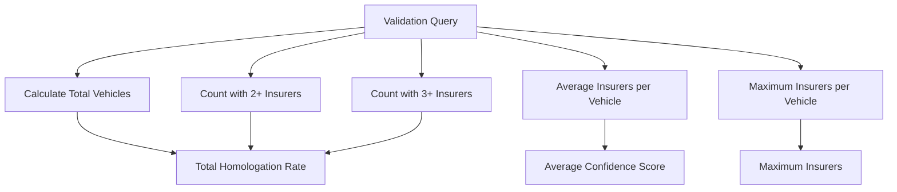
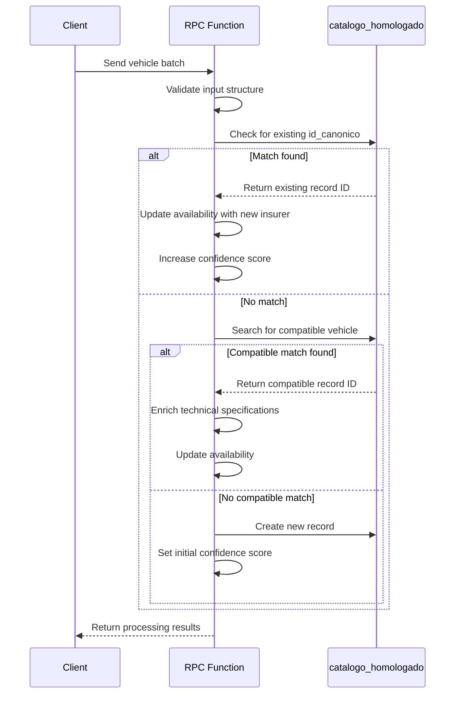
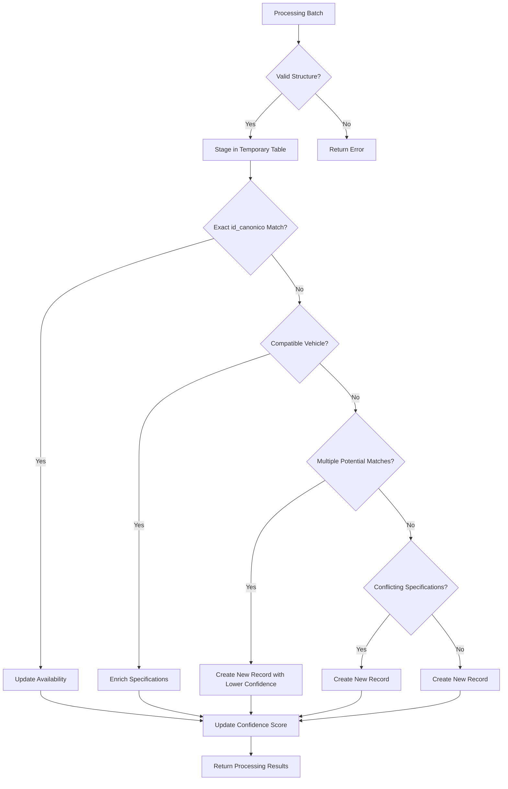

# Validation and Testing

<cite>
**Referenced Files in This Document**   
- [casos de prueba función rpc.sql](file://src/supabase/casos de prueba función rpc.sql)
- [Validacion y metricas.sql](file://src/supabase/Validacion y metricas.sql)
- [Funcion RPC.sql](file://src/supabase/Funcion RPC.sql)
- [Funcion RPC Nueva.sql](file://src/supabase/Funcion RPC Nueva.sql)
- [qualitas-analisis.md](file://src/insurers/qualitas/qualitas-analisis.md)
- [hdi-analisis.md](file://src/insurers/hdi/hdi-analisis.md)
- [zurich-analisis.md](file://src/insurers/zurich/zurich-analisis.md)
- [gnp-analisis.md](file://src/insurers/gnp/gnp-analisis.md)
- [elpotosi-analisis.md](file://src/insurers/elpotosi/elpotosi-analisis.md)
- [ana-analisis.md](file://src/insurers/ana/ana-analisis.md)
</cite>

## Table of Contents
1. [Introduction](#introduction)
2. [SQL-Based Validation Queries](#sql-based-validation-queries)
3. [Test Case Analysis](#test-case-analysis)
4. [Processing Metrics and Results](#processing-metrics-and-results)
5. [Improving Normalization Rules](#improving-normalization-rules)
6. [Writing Effective Test Cases](#writing-effective-test-cases)
7. [Common Data Issues](#common-data-issues)
8. [Conclusion](#conclusion)

## Introduction
This document provides comprehensive coverage of data validation and testing procedures for the vehicle homologation system. It details the SQL-based validation queries used to check data quality, detect anomalies, and measure processing metrics. The document explains how test cases verify the correct behavior of the RPC function under various scenarios including new records, updates, and conflicts. It covers the metrics tracked during processing such as processed records, warnings, errors, and deduplication rates. The document also describes how validation results are used to improve normalization rules and extraction queries, providing guidance on writing effective test cases for new insurers and validating edge cases in vehicle data.

## SQL-Based Validation Queries

The validation framework includes several SQL queries designed to assess data quality and homologation effectiveness. The primary validation query in `Validacion y metricas.sql` calculates key metrics for homologation quality by analyzing the master vehicle table.



**Diagram sources**
- [Validacion y metricas.sql](file://src/supabase/Validacion y metricas.sql#L1-L18)

The query uses a Common Table Expression (CTE) to calculate various metrics including the total number of canonical vehicles, the count of vehicles homologated with two or more insurers, and the average number of insurers per vehicle. These metrics provide insight into the effectiveness of the homologation process and help identify areas for improvement in data quality and coverage.

**Section sources**
- [Validacion y metricas.sql](file://src/supabase/Validacion y metricas.sql#L1-L18)

## Test Case Analysis

The test cases in `casos de prueba función rpc.sql` validate the RPC function's behavior under various scenarios. These test cases are designed to verify correct processing of new records, updates, conflicts, and progressive enrichment.

### Case 1: Initial Insertion
The first test case verifies the insertion of a new Toyota Yaris SEDAN record from Qualitas. This establishes a baseline record in the homologated catalog.

### Case 2: Same Vehicle from Different Insurer
The second test case adds the same vehicle (same id_canonico) from Zurich. This verifies that the system correctly identifies matching vehicles and updates the availability field to include multiple insurers rather than creating a duplicate record.

### Case 3: Conflicting Body Type
The third test case introduces a conflict by adding a Toyota Yaris with a HATCHBACK body type from HDI. This tests the system's ability to detect incompatibilities in technical specifications and create a separate record when conflicts exist.

### Case 4: Progressive Enrichment
The fourth test case demonstrates progressive enrichment by adding motor configuration (L4) information for the existing SEDAN vehicle. This verifies that the system can enhance existing records with additional technical specifications from different insurers.

### Case 5: Different Trim Level
The fifth test case adds a Toyota Yaris with a different trim level (CORE) from HDI. This tests the system's ability to recognize different vehicle variants and create separate records accordingly.

### Case 6: Progressive Enrichment with Missing Data
The sixth test case demonstrates progressive enrichment for a Volkswagen Gol with initially missing version and body type information. First, Qualitas provides basic information, then Zurich adds the HATCHBACK body type, verifying that the system can enrich incomplete records over time.



**Diagram sources**
- [casos de prueba función rpc.sql](file://src/supabase/casos de prueba función rpc.sql#L1-L255)
- [Funcion RPC Nueva.sql](file://src/supabase/Funcion RPC Nueva.sql#L1-L428)

**Section sources**
- [casos de prueba función rpc.sql](file://src/supabase/casos de prueba función rpc.sql#L1-L255)

## Processing Metrics and Results

The RPC function tracks comprehensive metrics during processing to monitor data quality and system performance. These metrics are returned in the JSON response from the `procesar_batch_homologacion` function.

### Key Metrics Tracked
The system tracks several key metrics for each processing batch:

- **Received**: Total number of vehicles received in the batch
- **Staged**: Number of vehicles successfully loaded into the temporary processing table
- **Nuevos**: Number of new records created
- **Enriquecidos**: Number of existing records enriched with additional information
- **Actualizados**: Number of records updated with new insurer availability
- **Conflictos**: Number of vehicles that could not be matched due to conflicting specifications
- **Multiples_matches**: Number of vehicles with multiple potential matches

### Confidence Scoring
The system implements a confidence scoring mechanism to assess data quality:

- **Initial confidence**: 1.0 for new records with complete information
- **Reduced confidence**: 0.8 for records created when multiple potential matches existed
- **Score increases**: Up to 0.05 for enrichment, up to 0.01 for adding insurer availability

### Warning and Error Handling
The system generates warnings for potential issues:

- **Multiple matches**: When a vehicle could potentially match multiple existing records
- **Conflicts**: When a vehicle conflicts with existing records in key specifications
- **Data quality issues**: Such as missing required fields or invalid data formats

The final summary query in the test cases provides an overview of the homologation results, including the total number of unique records, records with multiple insurers, and average confidence score.



**Diagram sources**
- [Funcion RPC Nueva.sql](file://src/supabase/Funcion RPC Nueva.sql#L1-L428)

**Section sources**
- [Funcion RPC Nueva.sql](file://src/supabase/Funcion RPC Nueva.sql#L1-L428)

## Improving Normalization Rules

Validation results are used to continuously improve normalization rules and extraction queries for each insurer. The analysis documents for individual insurers provide detailed insights into data quality issues and normalization strategies.

### Qualitas Normalization Improvements
The analysis of Qualitas data revealed that only 57.82% of records have identifiable trim levels. This led to the development of a comprehensive extraction strategy that:
- Uses a whitelist of valid trims in priority order
- Extracts technical specifications from the contaminated version field
- Filters out equipment codes that should not be part of the trim
- Handles special cases like brands with spaces (GENERAL MOTORS, ALFA ROMEO)

### HDI Normalization Improvements
HDI's data structure is cleaner with standardized comma-separated fields. The normalization strategy leverages this structure:
- Extracts trim from the first part before the first comma
- Systematically parses technical specifications from subsequent comma-separated parts
- Infers body type based on door count and explicit body type indicators
- Handles transmission codes and maps them to standard values

### Zurich Normalization Improvements
Zurich's data includes a dedicated transmission field and a well-structured VersionCorta field:
- Uses the dedicated transmission field as primary source
- Extracts trim from the beginning of VersionCorta before body type indicators
- Infers motor configuration from cylinder count
- Extracts traction information when present

### GNP Normalization Challenges
GNP presents significant challenges due to data contamination:
- No active/inactive field, requiring processing of all records
- Severe data contamination with other brand/model information
- Highly inconsistent version field structure
- Requires aggressive cleaning and validation

### El Potosi Normalization Strategy
El Potosi has two version formats (new and old) requiring different parsing approaches:
- Uses VersionCorta if available, falls back to Description
- Removes brand/model prefixes from version text
- Implements comprehensive trim extraction with compound trim detection
- Infers body type from door count and explicit indicators

### ANA Normalization Approach
ANA's data includes 2-letter brand prefixes that must be removed:
- Cleans brand prefixes from version text
- Corrects duplicate brand entries (ISUZU/IZSUZU)
- Uses dedicated transmission field as primary source
- Implements robust door count extraction for body type inference

**Section sources**
- [qualitas-analisis.md](file://src/insurers/qualitas/qualitas-analisis.md#L1-L333)
- [hdi-analisis.md](file://src/insurers/hdi/hdi-analisis.md#L1-L525)
- [zurich-analisis.md](file://src/insurers/zurich/zurich-analisis.md#L1-L348)
- [gnp-analisis.md](file://src/insurers/gnp/gnp-analisis.md#L1-L281)
- [elpotosi-analisis.md](file://src/insurers/elpotosi/elpotosi-analisis.md#L1-L364)
- [ana-analisis.md](file://src/insurers/ana/ana-analisis.md#L1-L325)

## Writing Effective Test Cases

Creating effective test cases for new insurers requires understanding both the data structure and potential edge cases in vehicle information.

### Guidelines for New Insurer Test Cases
When writing test cases for a new insurer, consider the following guidelines:

1. **Verify Data Structure**: Test that the function correctly handles the insurer's data format
2. **Test Edge Cases**: Include vehicles with missing or unusual values
3. **Validate Normalization**: Ensure trim levels, body types, and technical specifications are correctly extracted
4. **Check Deduplication**: Verify that duplicate vehicles are properly identified and merged
5. **Test Conflict Resolution**: Include scenarios where the same vehicle has conflicting specifications

### Vehicle Data Edge Cases
Common edge cases in vehicle data include:

- **Missing trim levels**: Many vehicles have no identifiable trim
- **Inconsistent body types**: Same model offered as both SEDAN and HATCHBACK
- **Transmission variations**: Same model with manual and automatic options
- **Engine configuration differences**: Same model with different engine options
- **Special editions**: Limited edition vehicles with unique specifications

### Test Case Structure
Effective test cases should follow this structure:

1. **Preparation**: Set up the test environment and clean any previous test data
2. **Initial Insertion**: Add a baseline vehicle record
3. **Progressive Enrichment**: Add the same vehicle with additional specifications
4. **Conflict Testing**: Add the same vehicle with conflicting specifications
5. **Edge Case Testing**: Include vehicles with missing or unusual data
6. **Verification**: Check the final state of the homologated catalog
7. **Summary**: Provide metrics on the test results

### Example Test Case Template
```sql
-- ========================================
-- TEST: [Description of test scenario]
-- ========================================
-- Preparation
TRUNCATE TABLE catalogo_homologado CASCADE;

-- Test case execution
SELECT public.procesar_batch_homologacion(
  jsonb_build_object('vehiculos_json', '[
    {
      "id_canonico": "[unique_hash]",
      "hash_comercial": "[commercial_hash]",
      "string_comercial": "[commercial_string]",
      "string_tecnico": "[technical_string]",
      "marca": "[brand]",
      "modelo": "[model]",
      "anio": [year],
      "transmision": "[transmission]",
      "version": "[trim]",
      "motor_config": "[engine_config]",
      "carroceria": "[body_type]",
      "traccion": "[traction]",
      "origen_aseguradora": "[insurer]",
      "id_original": "[original_id]",
      "version_original": "[original_version]",
      "activo": true
    }
  ]'::jsonb)
) AS resultado;

-- Verification
SELECT id, marca, modelo, anio, version, carroceria, 
       jsonb_pretty(disponibilidad) as disponibilidad
FROM catalogo_homologado;
```

**Section sources**
- [casos de prueba función rpc.sql](file://src/supabase/casos de prueba función rpc.sql#L1-L255)

## Common Data Issues

The validation process has identified several common data issues across insurers that require specific handling strategies.

### Data Contamination
Many insurers include irrelevant information in their version fields:
- **Equipment codes**: ABS, BA, AA, QC, VP, etc.
- **Brand/model prefixes**: Including brand names in version fields
- **Marketing text**: Descriptive phrases not relevant to vehicle specifications
- **Redundant information**: Repeating transmission or other specifications

### Inconsistent Formatting
Formatting inconsistencies create challenges for normalization:
- **Case variations**: Mixed uppercase and lowercase
- **Spacing issues**: Inconsistent use of spaces and punctuation
- **Abbreviations**: Different abbreviations for the same specification
- **Separator variations**: Using commas, pipes, or spaces inconsistently

### Missing Data
Critical information is often missing:
- **Trim levels**: Many vehicles have no identifiable trim
- **Body types**: Not specified in the data
- **Engine configurations**: Missing cylinder count or configuration
- **Transmission**: Not specified or inconsistent with other data

### Conflicting Specifications
The same vehicle may have conflicting specifications across insurers:
- **Body type conflicts**: SEDAN vs HATCHBACK for the same model/year
- **Transmission conflicts**: Manual vs automatic for the same trim
- **Engine configuration conflicts**: Different engine options
- **Trim level conflicts**: Different trim names for the same vehicle

### Special Cases
Certain vehicle types present unique challenges:
- **Commercial vehicles**: With high occupant counts
- **Electric/hybrid vehicles**: With special powertrain configurations
- **Pickup trucks**: With tonnage specifications
- **Limited editions**: With unique trim levels

The validation framework addresses these issues through:
- **Aggressive cleaning**: Removing equipment codes and marketing text
- **Standardized formatting**: Converting to consistent case and spacing
- **Intelligent inference**: Inferring missing specifications from available data
- **Conflict detection**: Identifying and flagging conflicting specifications
- **Comprehensive whitelists**: Valid trim levels and specifications

**Section sources**
- [qualitas-analisis.md](file://src/insurers/qualitas/qualitas-analisis.md#L1-L333)
- [hdi-analisis.md](file://src/insurers/hdi/hdi-analisis.md#L1-L525)
- [zurich-analisis.md](file://src/insurers/zurich/zurich-analisis.md#L1-L348)
- [gnp-analisis.md](file://src/insurers/gnp/gnp-analisis.md#L1-L281)
- [elpotosi-analisis.md](file://src/insurers/elpotosi/elpotosi-analisis.md#L1-L364)
- [ana-analisis.md](file://src/insurers/ana/ana-analisis.md#L1-L325)

## Conclusion
The validation and testing framework for the vehicle homologation system provides comprehensive coverage of data quality, processing metrics, and edge case handling. The SQL-based validation queries effectively measure homologation quality and identify areas for improvement. The test cases thoroughly verify the RPC function's behavior under various scenarios including new records, updates, conflicts, and progressive enrichment. The system tracks detailed metrics including processed records, warnings, errors, and deduplication rates, along with a confidence scoring mechanism to assess data quality. Validation results are used to continuously improve normalization rules and extraction queries for each insurer, addressing common data issues such as contamination, inconsistent formatting, missing data, and conflicting specifications. The framework provides clear guidance for writing effective test cases for new insurers and validating edge cases in vehicle data, ensuring robust and reliable homologation across diverse data sources.