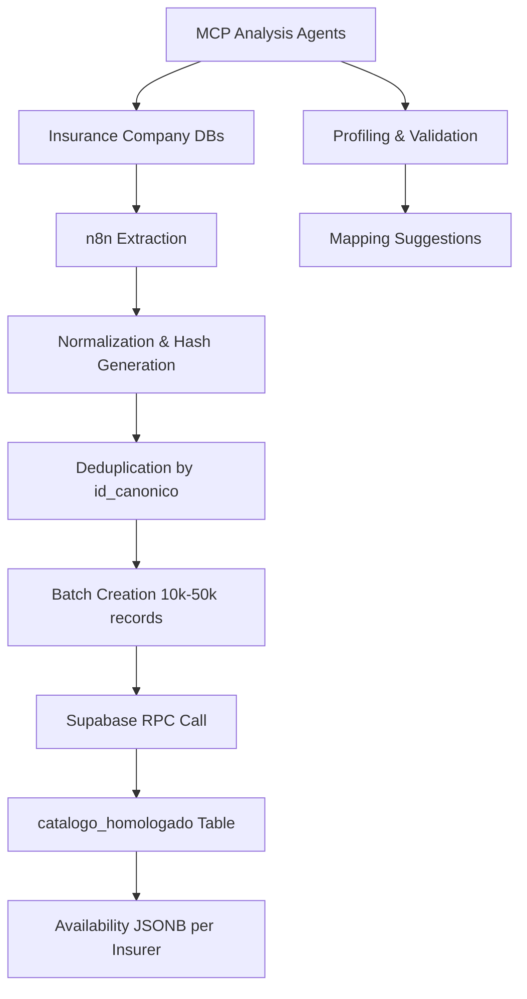

# WARP.md

This file provides guidance to WARP (warp.dev) when working with code in this repository.

## Project Overview

This is a **vehicle catalog homologation system** that unifies vehicle catalogs from multiple Mexican insurance companies (Qualitas, HDI, AXA, GNP, Mapfre, Chubb, Zurich, Atlas, BX, El Potosí, ANA) into a single canonical model. The system provides complete traceability per insurer, active/inactive status control, and a reproducible ingestion and update flow using n8n → Supabase RPC → `catalogo_homologado`.

### Key Components
- **Source Data**: Vehicle catalog tables from 11 insurance companies  
- **Normalization**: n8n workflows for data transformation and deduplication
- **Storage**: Supabase (PostgreSQL + PostgREST) with canonical table
- **Analysis**: MCP agents for data profiling and validation

## Quick Start

### Prerequisites

- **Node.js** (v18+ recommended) - for testing normalization functions
- **PostgreSQL client** (psql) - for database operations 
- **CSV tools** (available on macOS/Linux) - for data analysis

### Basic Setup

```bash
# Clone and navigate to project
cd homologacion-ukuvi/

# Verify data files are present
ls -la data/origin/

# Check total records across all insurers
wc -l data/origin/*.csv

# Sample data from Qualitas (largest dataset)
head -n 5 data/origin/qualitas-origin.csv
```

### Environment Setup

Create a `.env` file for Supabase connection:

```bash
# Copy template
cp .env.example .env

# Edit with your Supabase credentials
# SUPABASE_URL=https://your-project.supabase.co
# SUPABASE_SERVICE_ROLE_KEY=your-service-role-key
# SUPABASE_ANON_KEY=your-anon-key
```

## Project Structure

```
homologacion-ukuvi/
├── instrucciones.md          # Complete project specifications
├── src/
│   ├── supabase/            # Database schema and RPC functions
│   │   ├── Tabla maestra.sql        # Main homologated catalog table
│   │   ├── Funcion RPC.sql          # Original batch processing function  
│   │   ├── Funcion RPC Nueva.sql    # Latest batch processing function
│   │   ├── Validacion y metricas.sql
│   │   └── casos de prueba función rpc.sql
│   └── insurers/            # Per-insurer extraction and normalization
│       ├── qualitas/        # Qualitas-specific code
│       │   ├── qualitas-analisis.md
│       │   ├── qualitas-query-de-extracción.sql
│       │   └── qualitas-codigo-de-normalizacion-n8n.js
│       ├── hdi/             # HDI-specific code
│       ├── axa/             # AXA-specific code
│       ├── gnp/             # GNP-specific code
│       └── [...]/           # Other insurers
└── data/
    └── origin/              # Source data CSV files
        ├── qualitas-origin.csv
        ├── hdi-origin.csv
        └── [...]-origin.csv
```

## Common Commands

### Data Analysis and Profiling

```bash
# View source data sample
head -n 10 data/origin/qualitas-origin.csv

# Count records per insurer
wc -l data/origin/*.csv

# Search for specific patterns in analysis files
grep -r "TRIM" src/insurers/*/
```

### SQL Development

```bash
# Connect to Supabase (requires environment setup)
psql -h <supabase-host> -U postgres -d postgres

# Test RPC function locally
# (Copy SQL from src/supabase/casos de prueba función rpc.sql)

# Validate table structure
\d catalogo_homologado
\d vehiculos_maestro
```

### JavaScript Normalization Testing

```bash
# Test normalization functions (requires Node.js)
cd src/insurers/qualitas/

# Create a simple test file
cat > test_normalization.js << 'EOF'
function normalizarTexto(texto) {
  if (!texto) return '';
  return texto.toString()
    .toUpperCase()
    .normalize('NFD')
    .replace(/[\u0300-\u036f]/g, '')
    .replace(/[^A-Z0-9\s\-\/]/g, ' ')
    .replace(/\s+/g, ' ')
    .trim();
}
console.log('Input: ADVANCE 5P L4 1.5T AUT., 05 OCUP.');
console.log('Output:', normalizarTexto('ADVANCE 5P L4 1.5T AUT., 05 OCUP.'));
EOF

# Run the test
node test_normalization.js

# Clean up
rm test_normalization.js

# Check available normalization files
ls -la *.js
```

## Data Architecture

### Canonical Data Model

The system centers around a unified vehicle catalog table with these key identifiers:

- **`id_canonico`**: SHA-256 hash of complete vehicle specification
- **`hash_comercial`**: SHA-256 hash of commercial data (brand|model|year|transmission)
- **`string_comercial`**: Human-readable commercial string
- **`string_tecnico`**: Complete technical specification string

### Data Flow



### Active/Inactive Status Logic

- **Active**: Insurer reports the vehicle as currently available (`activo=true`)
- **Inactive**: Insurer no longer offers the vehicle (`activo=false`)  
- **Global Validity**: Vehicle is valid if at least one insurer reports it as active
- **Persistence**: System never deletes records, only updates availability status

## Key Database Operations

### Main RPC Function

```sql
-- Primary batch processing function
SELECT procesar_batch_homologacion(vehiculos_json::jsonb)
FROM (VALUES ('{"vehiculos_json": [...]}')) AS t(vehiculos_json);
```

### Querying Homologated Data

```sql
-- Find all active vehicles for a specific brand/model
SELECT marca, modelo, anio, version, aseguradoras_activas
FROM vehiculos_maestro 
WHERE marca = 'TOYOTA' 
  AND modelo = 'YARIS'
  AND 'QUALITAS' = ANY(aseguradoras_activas);

-- Get availability by insurer
SELECT marca, modelo, anio,
       disponibilidad_aseguradoras->'QUALITAS'->>'activo' as qualitas_activo,
       disponibilidad_aseguradoras->'HDI'->>'activo' as hdi_activo
FROM catalogo_homologado
WHERE marca = 'TOYOTA' AND modelo = 'COROLLA';
```

## Normalization Process

Each insurer has specific normalization rules. Example for Qualitas:

### Key Normalization Functions

```javascript
// Clean and normalize text
function normalizarTexto(texto) {
  return texto.toUpperCase()
    .normalize("NFD")
    .replace(/[\u0300-\u036f]/g, "")
    .replace(/[^A-Z0-9\s\-\/]/g, " ")
    .replace(/\s+/g, " ")
    .trim();
}

// Generate canonical hash
function generarHash(...componentes) {
  const texto = componentes
    .filter(c => c !== undefined && c !== null)
    .join("|").toUpperCase();
  return crypto.createHash("sha256").update(texto).digest("hex");
}
```

### Field Mapping Examples

- **Qualitas**: `cVersion` field contains mixed data requiring complex parsing
- **HDI**: Separate `InformacionVehiculo` and `Transmision` tables
- **AXA**: Uses `Marca`, `Subtipo`, `Versiones`, `Linea` structure
- **Zurich**: Has `Marcas`, `Modelos`, `SubMarcas`, `Version` hierarchy

## Development Workflow

### 1. Adding New Insurer Support

```bash
# Create insurer directory structure
mkdir src/insurers/nueva-aseguradora/
touch src/insurers/nueva-aseguradora/nueva-aseguradora-analisis.md
touch src/insurers/nueva-aseguradora/nueva-aseguradora-query-de-extraccion.sql
touch src/insurers/nueva-aseguradora/nueva-aseguradora-codigo-de-normalizacion.js
```

### 2. Data Analysis Process

1. Export source data to `data/origin/`
2. Create analysis markdown file documenting patterns
3. Write extraction SQL query
4. Develop normalization JavaScript code
5. Test with sample data

### 3. Testing Normalization

```javascript
// Template for testing normalization functions
const testCases = [
  {
    input: "ADVANCE 5P L4 1.5T AUT., 05 OCUP.",
    expected: {
      version: "ADVANCE",
      motor_config: "L4", 
      transmision: "AUTO"
    }
  }
];

testCases.forEach(test => {
  const result = procesarVersion(test.input);
  console.log('Input:', test.input);
  console.log('Result:', result);
  console.log('Expected:', test.expected);
});
```

## Configuration

### Environment Variables

The system integrates with Supabase and requires these environment variables for n8n workflows:

```bash
SUPABASE_URL=https://your-project.supabase.co
SUPABASE_SERVICE_ROLE_KEY=your-service-role-key
SUPABASE_ANON_KEY=your-anon-key
```

### Supabase RPC Endpoint

```
POST /rest/v1/rpc/procesar_batch_homologacion
Headers:
  - apikey: <service_role_key>
  - Authorization: Bearer <service_role_jwt>
  - Content-Type: application/json
```

## Data Quality and Validation

### Key Metrics to Monitor

- **Coverage**: Percentage of source records successfully normalized
- **Deduplication**: Effectiveness of `id_canonico` uniqueness
- **Completeness**: Fields with high null rates requiring attention
- **Consistency**: Cross-insurer validation for same vehicles

### Common Data Issues

1. **Version Field Contamination**: Mixed trim/specs in single field
2. **Transmission Mapping**: Inconsistent abbreviations (AUT→AUTO, STD→MANUAL)
3. **Brand Name Variations**: Mercedes vs Mercedes-Benz vs MB
4. **Missing Technical Specs**: Engine config, body style inference

## MCP Agent Integration

The system uses MCP (Model Context Protocol) agents for automated analysis:

### Analysis Queries Template

```sql
-- Cardinality analysis
SELECT COUNT(*) total,
       COUNT(DISTINCT marca) d_marcas,
       COUNT(DISTINCT modelo) d_modelos,
       SUM(CASE WHEN version IS NULL THEN 1 ELSE 0 END) nulos_version
FROM {insurer_table};

-- Value sampling
SELECT marca, COUNT(*) as freq
FROM {insurer_table}
GROUP BY marca
ORDER BY freq DESC
LIMIT 20;
```

## Troubleshooting

### Common Issues

1. **Hash Collisions**: Different vehicles with same `id_canonico`
   - Solution: Review normalization logic, add distinguishing fields

2. **RPC Timeout**: Large batches exceeding execution time
   - Solution: Reduce batch size from 50k to 10k records

3. **Encoding Issues**: Special characters in vehicle names
   - Solution: Apply proper UTF-8 normalization in `normalizarTexto()`

4. **Missing Source Data**: Insurance company API changes
   - Solution: Update extraction queries, validate field mappings

### Data Validation Commands

```sql
-- Check for suspicious duplicates
SELECT id_canonico, COUNT(*) as count
FROM catalogo_homologado
GROUP BY id_canonico
HAVING COUNT(*) > 1;

-- Validate hash consistency  
SELECT *
FROM catalogo_homologado
WHERE id_canonico != encode(sha256((hash_comercial || '|' || 
  COALESCE(version, '') || '|' || 
  COALESCE(motor_config, '') || '|' || 
  COALESCE(carroceria, '') || '|' || 
  COALESCE(traccion, ''))::bytea), 'hex');
```

## Success Criteria

The homologation system achieves success when:

1. **100% Source Coverage**: All source records represented in canonical model
2. **Idempotent Processing**: Re-running batches produces no unintended changes  
3. **Complete Traceability**: Each canonical record links back to original insurer data
4. **Active Status Accuracy**: Real-time reflection of insurer availability

## WARP-Specific Guidelines

When working with this codebase, WARP should:

1. **Always Use Context7 Tools**: Research current documentation for:
   - PostgreSQL/Supabase features and syntax
   - n8n workflow patterns and best practices
   - JavaScript crypto and string manipulation libraries

2. **Validate SQL Before Execution**: Test all database queries on sample data first

3. **Preserve Data Integrity**: Never suggest commands that could delete or corrupt homologated data

4. **Document Analysis Results**: When analyzing new insurer data, create comprehensive analysis markdown files following existing patterns

5. **Test Normalization Logic**: Always validate normalization functions with real data samples before production use

## References

- **Project Specifications**: See `instrucciones.md` for complete requirements
- **Supabase Documentation**: https://supabase.com/docs/guides/database/functions  
- **n8n Documentation**: https://docs.n8n.io/
- **PostgreSQL JSONB**: https://www.postgresql.org/docs/current/datatype-json.html

<citations>
<document>
    <document_type>RULE</document_type>
    <document_id>TgtNDG5nFVIXwwHSPJjWu2</document_id>
</document>
</citations>