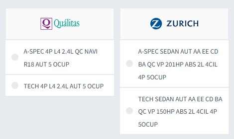

Buenos días a todos, al rato les entregamos unos ejemplos más pero les quería apuntar de una vez un tema que me parece fundamental y que señala que seguimos teniendo problemas importantes en este proceso de homologación. Es ejemplo no lo busqué, simplemente resaltó al abrir el archivo de Zurich. En nuestras bases, el caso esta así: cotizamos un Acura ILX del 2017 y vemos lo siguiente....

En el archivo, se homologó así: Zurich = A-SPEC 201HP 2.0L 4CIL 4PUERTAS 5OCUP Qualitas = TECH 4P L4 2.4L AUT 5 OCUP. En las demás aseguradoras se homologó bien. Entonces, creo que es un caso que simplemente no debería darse, porque de las complejidades de homologaciones es de un nivel bajo, hay versiones A-SPEC y TECH. Es un error que no debe de ocurrir.

Otro ejemplo de lo mismo: Jetta 2012 transmisión automática. Zurich = GEN VI STYLE 2.5L B/A LAT DEL 5CIL 4PUERTAS en GNP = JETTA SPORT 2.5 QC BA AC AUT. En el cotizador esta la opción "VW STYLE ACTIVE TIPTRONIC" pero en el archivo de Zurich no esta esta versión. En todo caso, la homologación correcta hubiera sido "nullo".

No me queda claro porque falta la versión de GNP.
