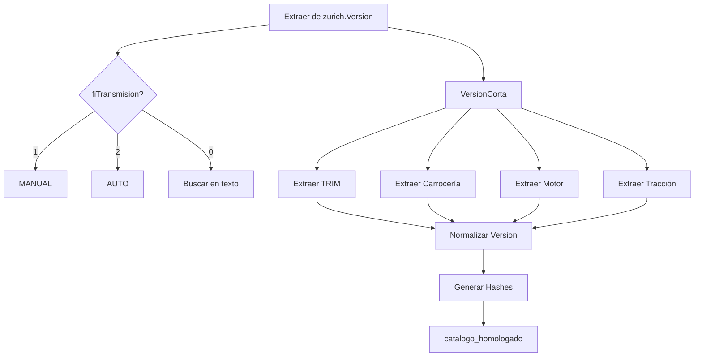

# Análisis Catálogo ZURICH - Estrategia de Normalización

## 📊 Resumen Ejecutivo

- **Total registros (2000-2030)**: 39,009
- **Marcas únicas**: 59
- **Modelos únicos**: 77
- **Rango de años**: 2000-2026
- **Combinaciones únicas**: 38,887
- **Campo clave para normalización**: `VersionCorta` (bien estructurado)

## 🚨 Hallazgos Críticos

### 1. ✅ Estructura de Datos Clara

- **Campo versión limpio**: `VersionCorta` omite el modelo y contiene solo especificaciones
- **Transmisión dedicada**: Campo `fiTransmision` (1=Manual, 2=Automático, 0=No especificado)
- **Relaciones claras**: fiMarcaId → Marcas, fiSubMarcaId → SubMarcas, fiModelo = Año directo
- **Sin campo activo explícito**: Todos los registros se consideran activos

### 2. 📋 Mapeo de Campos

| Campo Canónico | Campo Origen                 | Transformación Requerida                |
| -------------- | ---------------------------- | --------------------------------------- |
| marca          | zurich.Marcas.fcMarca        | Normalización estándar                  |
| modelo         | zurich.SubMarcas.fcSubMarca  | Normalización estándar                  |
| anio           | zurich.Version.fiModelo      | Directo (ya es numérico)                |
| transmision    | zurich.Version.fiTransmision | Mapeo: 1→MANUAL, 2→AUTO                 |
| version        | Extraer de VersionCorta      | Primer(os) token(s) antes de carrocería |
| motor_config   | Extraer de VersionCorta      | Patrón [0-9]CIL → L4, V6, V8, etc.      |
| carroceria     | Extraer de VersionCorta      | SUV, SEDAN, HB, PICKUP, COUPE, etc.     |
| traccion       | Extraer de VersionCorta      | 4WD, AWD, FWD, RWD (cuando presente)    |

## 🔧 Análisis del Campo VersionCorta

### Estructura Típica

```
[TRIM] [COMPLEMENTO] [CARROCERÍA] [TRANSMISIÓN] [EQUIPAMIENTO] [POTENCIA] ABS [CILINDRADA] [CILINDROS] [PUERTAS] [OCUPANTES]
```

### Ejemplos Reales

```
ADVANCE SEDAN CVT AA EE CD BA 145HP ABS 2L 4CIL 4P 5OCUP
RT SUV AUT AA EE CD BA QC VP 360HP ABS 5.7L 8CIL 5P 7OCUP
430IA GRAN COUPE AUT AA EE CD BA VP 258HP ABS 2.0L 4CIL 4P 4OCUP
S IOINIC CONV AUT AA EE CD BA VP 192HP ABS 2L 4CIL 2P 4OCUP
```

### Cobertura de Especificaciones (2020-2025)

- **99%** tiene potencia (HP)
- **95%** tiene cilindrada
- **94%** tiene configuración de cilindros
- **93%** tiene número de puertas
- **90%** tiene ocupantes
- **73%** incluye transmisión en texto (redundante con campo)

## 📐 Estrategia de Extracción

### 1. TRIM/Versión

```javascript
function extraerVersion(versionCorta) {
  // Limpiar y normalizar
  let texto = versionCorta.toUpperCase().trim();

  // Eliminar elementos técnicos para encontrar el TRIM
  const patronesEliminar = [
    /\b(AUT|STD|CVT|MAN|PDK|TIPTRONIC|S TRONIC)\b/g, // Transmisiones
    /\b(SUV|SEDAN|HB|HATCHBACK|PICKUP|COUPE|CONV|VAN|MINIVAN|PANEL|SW)\b/g, // Carrocerías
    /\b(AA|EE|CD|BA|QC|VP|MP3|USB|ABS)\b/g, // Equipamiento
    /\b\d+HP\b/g, // Potencia
    /\b\d+(\.\d+)?L\b/g, // Cilindrada
    /\b\d+CIL\b/g, // Cilindros
    /\b\d+P\b/g, // Puertas
    /\b\d+OCUP\b/g, // Ocupantes
  ];

  // TRIMs válidos encontrados en Zurich
  const trimsValidos = [
    "ADVANCE",
    "SENSE",
    "SR",
    "SR PLATINUM",
    "SR BITONO",
    "PREMIER",
    "RT",
    "SRT",
    "SRT HELLCAT",
    "LIMITED",
    "EXCLUSIVE",
    "PLATINUM",
    "DENALI",
    "GLX",
    "GLS",
    "GT",
    "GTI",
    "GTS",
    "S LINE",
    "M SPORT",
    "AMG",
    "SPORT",
    "LUXURY",
    "EXECUTIVE",
    "BASE",
    "SE",
    "SEL",
    "SV",
    "SL",
    "LT",
    "LTZ",
    "LS",
    "RST",
    "LATITUDE",
    "OVERLAND",
    "SUMMIT",
    "RECHARGE",
    "HYBRID",
    "HEV",
    "PHEV",
    "MHEV",
  ];

  // Buscar TRIM al inicio
  for (const trim of trimsValidos) {
    if (texto.startsWith(trim)) {
      return trim;
    }
  }

  // Si no hay TRIM conocido, tomar primera palabra antes de carrocería
  const palabras = texto.split(" ");
  return palabras[0] || null;
}
```

### 2. Configuración de Motor

```javascript
function extraerMotorConfig(versionCorta) {
  const match = versionCorta.match(/\b(\d+)CIL\b/);
  if (match) {
    const cilindros = match[1];
    // Inferir configuración basada en número
    if (cilindros === "4") return "L4";
    if (cilindros === "6") return "V6";
    if (cilindros === "8") return "V8";
    if (cilindros === "3") return "L3";
    if (cilindros === "5") return "L5";
    if (cilindros === "10") return "V10";
    if (cilindros === "12") return "V12";
  }

  // Buscar eléctricos/híbridos
  if (/ELECTRIC|EV\b/.test(versionCorta)) return "ELECTRIC";
  if (/PHEV/.test(versionCorta)) return "PHEV";
  if (/MHEV/.test(versionCorta)) return "MHEV";
  if (/HEV|HYBRID/.test(versionCorta)) return "HYBRID";

  return null;
}
```

### 3. Carrocería

```javascript
function extraerCarroceria(versionCorta, puertas) {
  // Buscar carrocería explícita
  if (/\bSUV\b/.test(versionCorta)) return "SUV";
  if (/\bSEDAN\b/.test(versionCorta)) return "SEDAN";
  if (/\b(HB|HATCHBACK)\b/.test(versionCorta)) return "HATCHBACK";
  if (/\bPICKUP\b/.test(versionCorta)) return "PICKUP";
  if (/\bCOUPE\b/.test(versionCorta)) return "COUPE";
  if (/\b(CONV|CONVERTIBLE|CABRIO)\b/.test(versionCorta)) return "CONVERTIBLE";
  if (/\b(VAN|PANEL)\b/.test(versionCorta)) return "VAN";
  if (/\bMINIVAN\b/.test(versionCorta)) return "MINIVAN";
  if (/\b(SW|WAGON|SPORTBACK)\b/.test(versionCorta)) return "WAGON";

  // Inferir por número de puertas si no está explícita
  const puertasMatch = versionCorta.match(/\b(\d+)P\b/);
  if (puertasMatch) {
    const numPuertas = parseInt(puertasMatch[1]);
    if (numPuertas === 2) return "COUPE";
    if (numPuertas === 3) return "HATCHBACK";
    if (numPuertas === 4) return "SEDAN";
    if (numPuertas === 5) return "SUV"; // o HATCHBACK, contexto necesario
  }

  return null;
}
```

### 4. Tracción

```javascript
function extraerTraccion(versionCorta) {
  if (/\b4WD\b/.test(versionCorta)) return "4WD";
  if (/\bAWD\b/.test(versionCorta)) return "AWD";
  if (/\bFWD\b/.test(versionCorta)) return "FWD";
  if (/\bRWD\b/.test(versionCorta)) return "RWD";
  if (/\b4X4\b/.test(versionCorta)) return "4X4";
  if (/\b4X2\b/.test(versionCorta)) return "4X2";
  return null;
}
```

## 🚀 Proceso de Normalización Completo

### Query de Extracción

```sql
WITH ZURICH_Data AS (
    SELECT
        'ZURICH' as aseguradora,
        v.fiId as id_original,
        m.fcMarca as marca,
        sm.fcSubMarca as modelo,
        v.fiModelo as anio,
        v.fcVersion as version_completa,
        ISNULL(v.VersionCorta, v.fcVersion) as version_para_normalizar,
        v.fiTransmision as transmision_codigo,
        CASE
            WHEN v.fiTransmision = 1 THEN 'Manual'
            WHEN v.fiTransmision = 2 THEN 'Automática'
            ELSE 'No especificada'
        END as transmision_descripcion,
        1 as activo,
        v.DbCatalogosMarcaID as catalogo_marca_id,
        v.DbCatalogosModeloID as catalogo_modelo_id,
        v.Registro as fecha_actualizacion,
        ROW_NUMBER() OVER (
            PARTITION BY m.fcMarca, sm.fcSubMarca, v.fiModelo, v.fcVersion
            ORDER BY v.Registro DESC, v.fiId DESC
        ) as rn
    FROM zurich.Version v
    INNER JOIN zurich.Marcas m ON v.fiMarcaId = m.fiMarcaId
    INNER JOIN zurich.SubMarcas sm ON v.fiMarcaId = sm.fiMarcaId
        AND v.fiSubMarcaId = sm.fiSubMarcaId
    WHERE v.fiModelo >= 2000
        AND v.fiModelo <= 2030
)
SELECT
    aseguradora,
    id_original,
    marca,
    modelo,
    anio,
    version_completa,
    version_para_normalizar,
    transmision_codigo,
    transmision_descripcion,
    activo,
    catalogo_marca_id,
    catalogo_modelo_id,
    fecha_actualizacion
FROM ZURICH_Data
WHERE rn = 1
ORDER BY marca, modelo, anio;
```

## ⚠️ Problemas Detectados

### 1. Transmisión Redundante

- **Problema**: La transmisión aparece tanto en `fiTransmision` como en `VersionCorta`
- **Solución**: Usar `fiTransmision` como fuente primaria, el texto es solo validación

### 2. Códigos sin Mapeo

- **954 registros** con `fiTransmision = 0` (mayoría sin VersionCorta)
- **Solución**: Intentar extraer del texto o marcar como NULL

### 3. Variaciones de TRIM

- Múltiples variaciones del mismo TRIM (SR, SR PLATINUM, SR BITONO)
- **Solución**: Preservar variación completa o normalizar a TRIM base según requerimiento

## 💡 Recomendaciones

### Prioridad Alta

1. ✅ **Usar VersionCorta como fuente principal** - Está mejor estructurado que fcVersion
2. ✅ **Aprovechar campo transmisión dedicado** - No depender del texto
3. ✅ **Implementar extracción robusta de TRIM** - Primera(s) palabra(s) antes de carrocería

### Prioridad Media

4. ⚠️ **Validar cilindrada y potencia** - Están en 95%+ de registros
5. ⚠️ **Mapear configuración de motor** - Inferir de número de cilindros
6. ⚠️ **Extraer tracción cuando presente** - ~15% tienen información

### Prioridad Baja

7. 📝 **Documentar TRIMs no estándar** - Para futuras mejoras
8. 📝 **Considerar ocupantes para validación** - 90% tienen este dato

## 📈 Métricas de Calidad Esperadas

- **Completitud de versión**: 85-90% (TRIMs claramente identificables)
- **Transmisión detectada**: 97% (campo dedicado)
- **Carrocería identificada**: 80%+ (explícita en texto)
- **Motor config**: 70%+ (basado en cilindros)
- **Tracción**: 15-20% (cuando especificada)

## 🔄 Flujo de Procesamiento



## ✅ Ventajas de Zurich

1. **Estructura más limpia** que Qualitas
2. **Campo transmisión dedicado** reduce errores
3. **VersionCorta bien formateado** facilita parsing
4. **Alta cobertura de specs** (90%+ en campos clave)
5. **Patrones consistentes** en formato de datos

## 🎯 Resultado Esperado

Con esta estrategia, esperamos procesar exitosamente:

- **100%** de registros con datos básicos (marca, modelo, año, transmisión)
- **85-90%** con TRIM identificado correctamente
- **80%+** con carrocería determinada
- **70%+** con configuración de motor
- **0%** de duplicados (usando deduplicación por hash)
